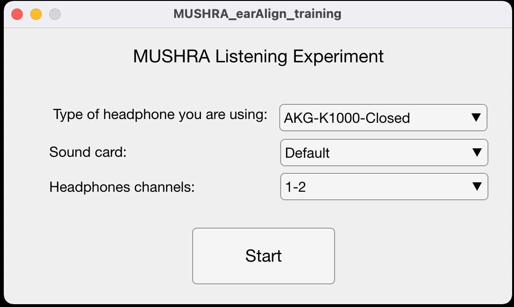
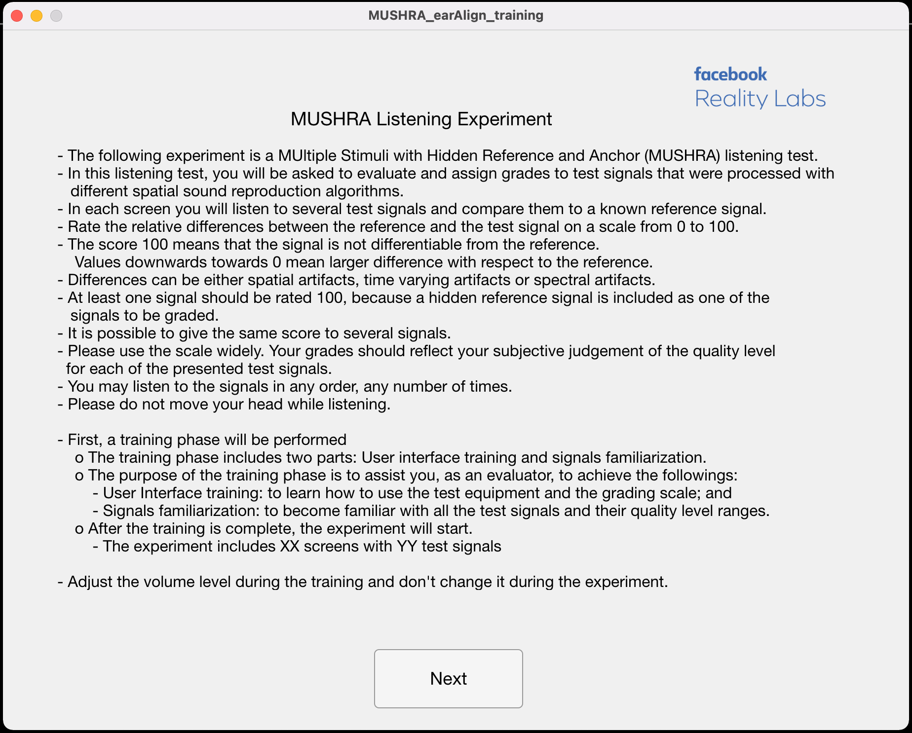
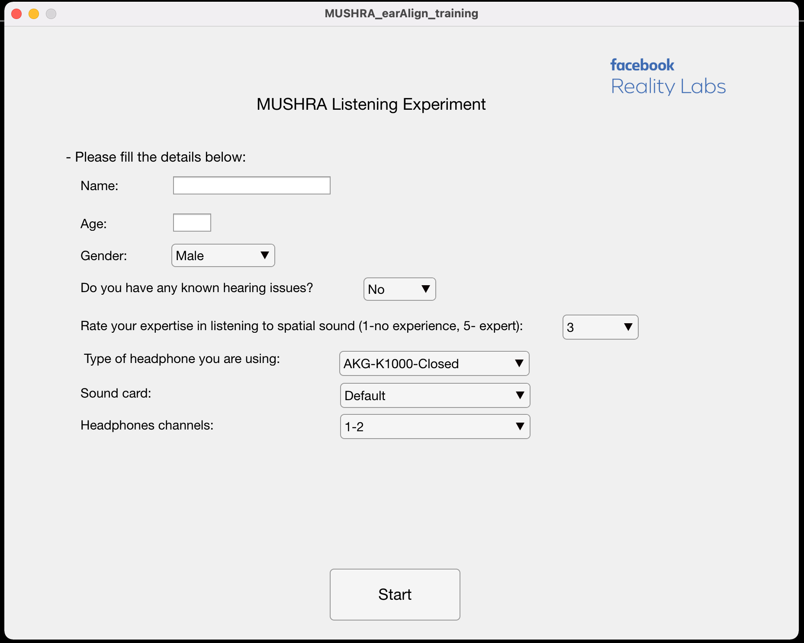
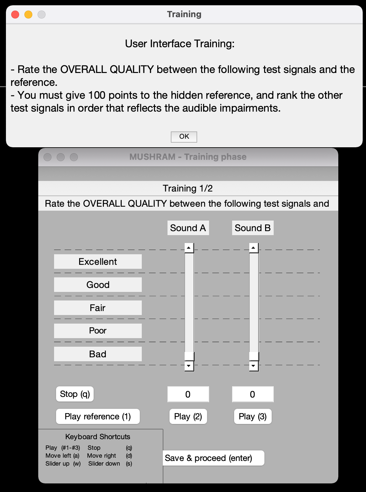
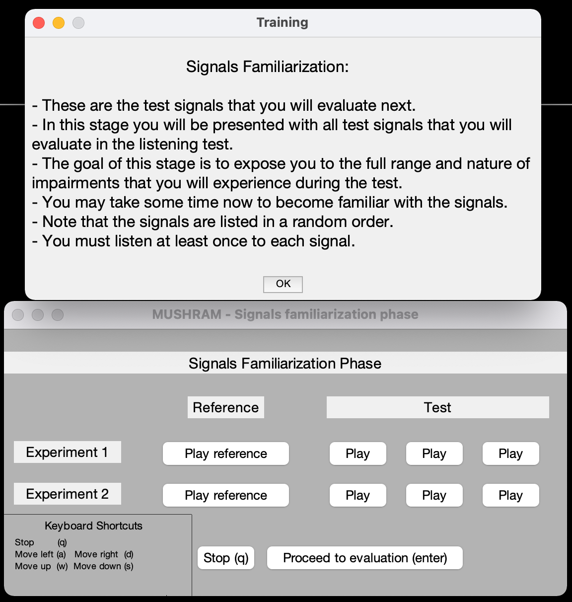
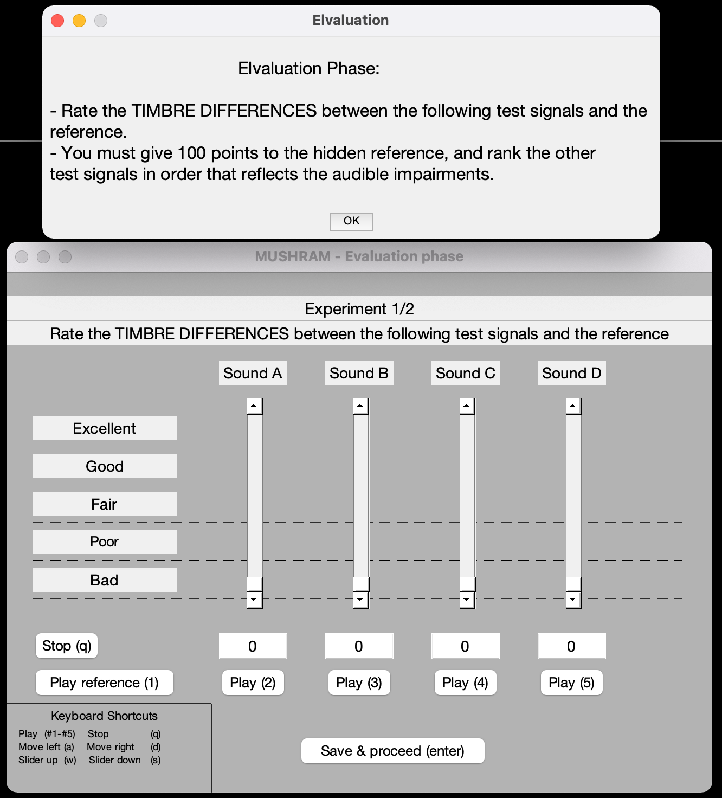

# How to Run MUSHRA Listening Test on Matlab

## Document imported from this [quip](https://fb.quip.com/3XtuAUVWcL2n)

Date: Tuesday, August 08, 2021

Author: Zamir Ben-Hur (zamirbh@fb.com)

Reviewers: David Lou Alon
* * *

## Introduction

 This document is meant to help you use the code for running MUSHRA listening tests on MATLAB.

MUSHRA means “**MU**lti **S**timulus test with **H**idden **R**eference and **A**nchor”. This is the recommendation ITU-R BS.1534-3 ([ITU-1534-3.pdf](https://fb.quip.com/-/blob/LdfAAANo2Hh/WZLuMwfQSF2H7CC8QSgr6A?name=ITU-1534-3.pdf))  for the subjective assessment of intermediate quality level of audio systems. In other words, MUSHRA listening tests allow the comparison of high quality reference sounds with several lower quality test sounds.

You should be familiar with the concepts of MUSHRA listening tests prior to running an experiment. For instance, it is recommended that you read thoroughly the text of the ITU-R recommendation. You should also read other recommendations related to subjective evaluation of audio quality to make sure that MUSHRA listening tests are an appropriate answer to your problem.


## Principles of MUSHRA listening test

 A well-thought listening test starts by a careful *selection* *of the test material*. MUSHRA listening tests are particularly suited to compare high quality reference sounds with lower quality test sounds. Thus test items where the test sounds have a near-transparent quality or where the reference sounds have a low quality should not be used. All the reference sounds and test sounds must be normalized to the same subjective loudness level (which is taking care of in the code, following  ITU-R BS.1770-4 and EBU R 128 standards). Also the amount of test material must be kept small enough for the subjects to perform the test within a reasonable time. The *selection of the subjects* is also important: for certain types of experiments, the results may vary depending whether the subjects are specialists or not. More detailed guidelines for the selection of test material and subjects are available in [ITU-1534-3.pdf](https://fb.quip.com/-/blob/LdfAAANo2Hh/WZLuMwfQSF2H7CC8QSgr6A?name=ITU-1534-3.pdf).

The listening test itself is divided into two successive phases: the **training phase** and the **evaluation phase**. 
The **training phase** includes two parts: **user interface training** and **signals familiarization**. The purpose of the training phase is to assist you, as an evaluator, to achieve the followings: 

* ****User interface training****: to learn how to use the test equipment and the grading scale; and
* ****Signals familiarization****: to become familiar with all the test signals and their quality level ranges. 

During this phase, the subject can also set the volume of the headphones to a comfortable level, but not too quiet so that impairments still remain perceptible. Recommendations on the volume level are given in the ITU recommendation. 

**The evaluation phase** consists of several successive experiments. The aim of each experiment is to compare a high quality reference sound to several test sounds sorted in random order, including the reference. Each subject is asked to assess the quality of each test sound (relative to the reference and other test sounds) by grading it on a quality scale between 0 and 100. It is not necessary that one test sound be graded 0, however at least one must be graded 100 (because the reference sound is among the test sounds). The test sounds can also include one or several anchor sounds.
 
After all the subjects have graded all the test sounds from all experiments, a post-screening of the subjects is performed to reject results produced by subjects that are either not critical enough or too critical. Finally, a statistical analysis of the results is conducted. Guidelines about these issues are again provided in the ITU recommendation. 

###  Important remarks

The training phase and the design of relevant anchor sounds are essential to obtain consistent gradings between subjects and reproducible results.

Without a proper training phase, some subjects tend to be either not critical enough (all sounds graded as good) or too critical (all sounds graded as bad), instead of using the whole grading scale. For instance, if only medium quality test sounds appear in the first experiment and if these test sounds are graded as bad, then low quality test sounds appearing in subsequent experiments will be graded as bad too. Conversely, if low quality test sounds appear in the first experiment and are graded as good, then all the test files in subsequent experiments will be graded as good too. Thus it is important that the subjects listen to all the test sounds during the training phase and identify the largest level of impairment. The consistence of gradings between experiments is also improved by randomizing the order of the experiments. 

Similarly, the design of relevant anchor sounds is important to evaluate the absolute quality of the test sounds by comparing them to well-defined levels of impairments. Anchor sounds should show similar impairment characteristics as the test sounds and be computed with the same simple signal processing operations for all experiments, so as to be easily reproducible.

Note that in the official recommendation, there must be a low-anchor which is the reference sound low-pass filtered at 3.5 kHz. This is relevant mostly for evaluating general audio quality, but less for spatial audio evaluation. In fact, in most of our experiments, we are not presenting any anchor in order to not skew the results toward high rankings.
 

## Download and run

The code is available in the FRLR-A GitHub repository:
https://ghe.oculus-rep.com/FrlAudio/frlasource/tree/master/projects/2020_Loon/MUSHRA_Matlab_template

(the code is based on the [MUSHRAM interface developed by Dr. Emmanuel Vincent, 2005](http://c4dm.eecs.qmul.ac.uk/downloads/#mushram))

The folder contains several sub-folders (detailed next) and a main script to run an example experiment:

```
MUSHRA_main.m
```

### Software dependencies

Required Matlab toolboxes: Signal Processing Toolbox, DSP System Toolbox, Audio Toolbox.

These toolboxes are needed for the audio processing, which was originally implemented by Isaac Engel (former intern). The processing enables the use of external sound-card and the smooth (and immediate) transitions between signals while listening.


## Configuring an experiment

The software supports two kinds of audio types:

* Audio signals in .wav file (mono or stereo)
* Impulse response + dry audio (both in .wav files, IR can be mono or stereo, dry audio should be mono)

The *IR_FLAG* in the *MUSHRA_main.m* script determines which one is used.

In order to setup a MUSHRA listening test, the configuration files inside the **ConfigFiles** folder should be edited, as follows:

* For **IR+dry signals:**
    * **MUSHRA_config_training_IRs.txt** - contains the configuration for the **training phase - user interface training**
    * **MUSHRA_config_training2_IRs.txt** - contains the configuration for the **training phase - signals familiarization**
    * **MUSHRA_config_IRs.txt** - contains the configuration for the **evaluation phase**
* Similarly, for **wav audio signals:**
    * **MUSHRA_config_training.txt** - contains the configuration for the **training phase - user interface training**
    * **MUSHRA_config_training2.txt** - contains the configuration for the **training phase - signals familiarization**
    * **MUSHRA_config.txt** - contains the configuration for the **evaluation phase**

**The evaluation configuration file is structure as follows:** 

* 1st line is a string that will be presented to the participants as the evaluation metric (e.g. Overall Quality, Timbre Differences, ...)
* The following lines are the files per experiment (for IR_dry, a dry audio file should be first, then the reference signal, then all the test signals)
* Space line to separate between experiments (MUSHRA screens)

For example, if you want to conduct 2 experiments with 3 files per experiment (including the reference), the **MUSHRA_config.txt** configuration file will look like this: 

```
METRIC TO EVALUATE
path/reference_1.wav 
path/test_1_a.wav 
path/test_1_b.wav

METRIC TO EVALUATE 2  
path/reference_2.wav 
path/test_2_a.wav 
path/test_2_b.wav
```

where path is the path to the directory containing the sound files relatively to the MUSHRA directory.
The **MUSHRA_config_IRs.txt** configuration file will look like this: 

```
METRIC TO EVALUATE
path/dryAudio_1.wav
path/reference_IR_1.wav 
path/test_IR_1_a.wav 
path/test_IR_1_b.wav

METRIC TO EVALUATE 2  
path/dryAudio_2.wav
path/reference_IR_2.wav 
path/test_IR_2_a.wav 
path/test_IR_2_b.wav
```

The trainings configuration files have the same structure (for training2 the ‘METRIC TO EVALUATE’ is not relevant, as it is not going to be visible to the participants. Nonetheless, the lines structure should be the same).


### Buffer size and fade length parameters

In order to allow for smooth switching between the audio signals while listening, a new audio player (InterruptibleAudioPlayer) was developed. 
There are several parameters that are related to the audio player and can affect the smoothness of switching between signals.
**If you experience a non-smooth switching**, try to change the parameters in **lines 332-334** of **mushram.m** (in the Mfiles folder):

```
fadeIn  = 0.001; % fade-in [sec]
fadeOut = 0.001; % fade-out [sec]
bufferSize = 1024; % buffer size [samples]
```

Additionally, the loop of the audio signals can be disabled/enabled by changing the flag in **line 335**:

```
loop = true;
```

### Headphone equalization

The software supports the use of headphone equalization (HpEQ) using a pre-defined headphone correction filter (HPCF), that are available in the HPCF folder. 
The desired HPCF can be chosen at the beginning of the experiment using the GUI.
If the ‘Other’ option is selected, no HpEQ will be applied.

The HPCF files are a .mat file contains an *hpcf* struct with the following fields:

* fs - sampling frequency [Hz]
* hpName - string with the filter name (which will be saved in the results file)
* minPhase - minimum phase filter (which will be used at the beginning of the experiment for HpEQ)
* linPhase - linear phase filter (not used currently)

Any filter with the same structure can be added to the HPCF folder.
The current filters available in the folder are taken from [B. Bernschütz, “A Spherical Far Field HRIR / HRTF Compilation of the Neumann KU 100,” in *Proceedings of the 39th DAGA*, 2013, pp. 592–595](https://zenodo.org/record/3928297#.YP_voS0RrDU). These were measured on a KU-100 dummy head.

**Note that although recent papers suggest that a generic HpEQ is beneficial (**[Isaac et al.](https://www.aes.org/e-lib/browse.cfm?elib=20387)**,** [Lindau & Brinkmann](https://www.aes.org/e-lib/browse.cfm?elib=16166)**), this should be used with caution.**


## Starting an experiment

 Once a listening test is configured, each subject can run it by running the ***MUSHRA_main.m*** script.

Two flags are exist changed in the main script:

* ***skipIntro*** -  flag to skip introduction screen and info collection screen (only choose Headphone type).
* ***IR_FLAG -*** if true, using IRs+dry audio with convolution during the test, else, use wav files as they are.

**If skipIntro==true**

The following GUI will open, with the options to choose HPCF, sound-card and channels (usually the default sound-card should work).



**else**

The following two successive GUIs will open, first, with instructions, and second with data collections questionnaire (which also has the option to choose HPCF and sound-card)




**end**

Pressing the ‘Start’ button will run successively three graphical interfaces (one for each of the training phases and one for the evaluation phase), the order of the experiments is randomized and the order of the test files within each experiment is randomized too. 

**Note that the instructions and the questionnaire can be changed by editing the *./Mfiles/MUSHRA_training_App.mlapp* and *./Mfiles/MUSHRA_training_App_2017a.mlapp (the latter is a duplication of the first one, but with some changes to support past Matlab versions)***

### Training phase - **user interface**

First, a window with a short description of the task will pop-up, then the GUI for the training will be visible (as seen in the figure below).
The GUI contains a slider for each test signals, with the corresponding ‘Play’ button, a ‘Play reference’ button, a ‘Stop’ button and a ‘Save & proceed’ button.

* The user interface training includes screens that are similar to the screens in the evaluation phase.
* In each screen the participant is asked to rate the ‘METRIC TO EVALUATE’ between the test signals (including a hidden reference) and the reference signal.
* A feedback will be given after each screen. If the ranking order is incorrect, a warning message will be displayed, and the same screen will be shown again. The order is according to the order in the config file.



### Training phase - **signals familiarization**

* In this stage the participant will be presented with all test signals that will be evaluate in the listening test (see figure below).
* The goal of this stage is to expose the participant to the full range and nature of impairments that they will experience during the test.
* Each row of buttons corresponds to one experiment of the evaluation phase.
* The leftmost button of each row plays the reference signal, and the other buttons play the test signals
* Note that the signals are listed in a random order.
* The participant must listen at least once to each signal.
* The participant can spend as much time as they like in this stage. When ready, click ‘Proceed to evaluation’.
* The participant should adjust the volume level to a comfort level during the training and shouldn't change it during the evaluation phase.



### Evaluation phase

After the training is complete, the evaluation phase will start.

* Each screen will contain different experiment (as defined in the config file). The screens will appear in a random order.
* In each screen, there are sliders for each test signal (including the hidden reference) .see the figure below.
* At least one signal should be rated 100, because a hidden reference signal is included as one of the signals to be graded.
* It is possible to give the same score to several signals.
* The participant may listen to the signals in any order, any number of times.



**Note that the dialog windows texts can be changed in the *./Mfiles/mushram.m* function lines 259, 283 and 308 for the evaluation, training 1 and training 2 phases, respectively.**


### ****Controls****

* The GUIs can be operate with mouse and/or keyboard.
* ****Mouse****: just click the buttons and drag and drop the sliders.
* ****Keyboard****: (in each screen there is a keyboard shortcut guide at the left bottom of the screen)
    * The keys for the user interface training and the evaluation phase:
      * Play - #  of play button
      * Stop - q
      * Change to play the signal to the left - a
      * Change to play the signal to the right - d
      * Move highlighted slider up - w
      * Move highlighted slider down - s
      * Save and proceed - enter
    * The keys for the signal familiarization:
      * Play (start playing the first reference) - d  
      * Stop - q
      * Change to play the signal to the left - a
      * Change to play the signal to the right - d
      * Change to play the signal above - w
      * Change to play the signal below - s
      * Proceed - enter

 

## Results files

The results will be saved automatically to the **Results** folder, after each experiment screen, with the filename *MUSHRA_Results_NAME##,* where *NAME* is the participant name (is applicable) and ## is a running number (in order to avoid overwrite of previous file)

The results are saved both in .csv and .mat files.
The .csv file contains:

* The participant ID number (assign automatically)
* Date
* Ratings of all the signals by the order they appear in the config file

The .mat file contains a ***responses*** struct with the following fields:

* userData - contains the data collected in the questionnaire
* stimuli - cell array with the signals names
* id - Participant ID
* date
* Comment - any comment added by the participant at the end of the test
* ratings (in the same order as the stimuli)
* headphones - name of the chosen HPCF


## Conclusions

The current implementation of the Matlab code for MUSHRA listening test has several advantages over the original MUSHRAM ([MUSHRAM interface developed by Dr. Emmanuel Vincent, 2005](http://c4dm.eecs.qmul.ac.uk/downloads/#mushram)):

* Supports playback of IRs+dryAudio which makes it more efficient with lower file sizes
* Support HpEQ
* Allows to switch instantly between two sounds
* Performs loudness equalization automatically 
* Support various evaluation metrics (to be presented to participants)
* User interface training with feedback
* Support various number of signals per experiment (screen) - *this may still be buggy and require more testing*


